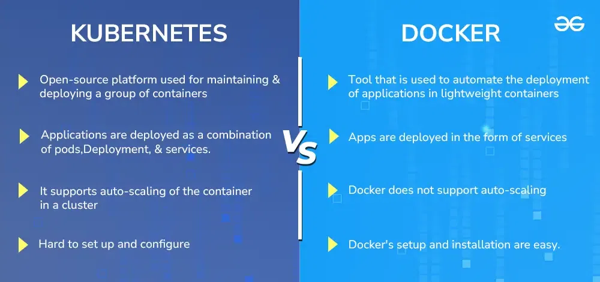
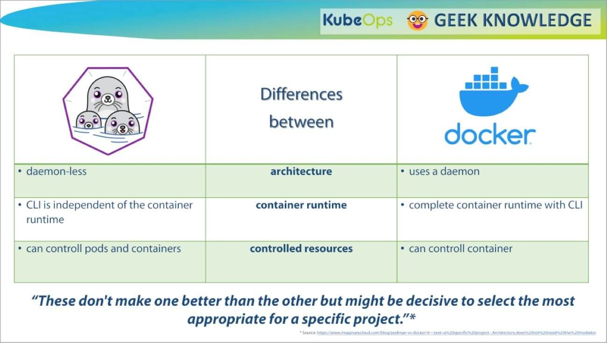

# Alternativas de docker

### Kubernetes
Kubernetes es un sistema de manejo de contenedores desarrollado en la plataforma de Google(GO). Kubernetes ayuda a gestionar una aplicación en contenedores en varios tipos de entornos fisicos, virtuales o de la nube.

Docker es una plataforma de contenedorización, mientras Kubernetes Maneja numerosos contenedores en tiempo de ejecución.

### Ventajas de Kubernetes
* Horario automático del contendor
* Servicio de descubrimiento
* Actualizaciones continuas
* Autosanación

### Desventajas
* Grande curva de aprendizaje
* Problemas de compatibilidad con herramientas Docker

## Podman
Podman is una herramienta nativa de Linux para hacer facil las acciones de encontrar, ejecutar, compartir, y desplegar aplicaciones usando contenedores OCI.
Podman.

### Ventajas de Podman
* Mas compatibilidad
* Intuitivo
* Requiere menos espacio de almacenamiento
* Mas eficiente

### Desventajas de Podman
* Mayor cantidad de bugs
* Errores frecuentes cuando se trata de contenedores

