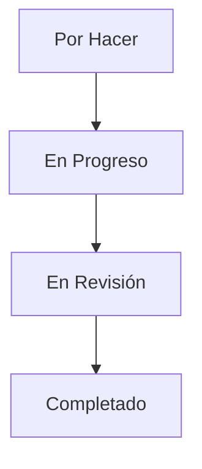

## 📌 Kanban
Kanban es una metodología visual que optimiza el flujo de trabajo y minimiza el desperdicio.

### 🔹 Principios
- **Empezar con lo existente**: No requiere cambios drásticos.
- **Mejoras incrementales**: Evolución continua.
- **Liderazgo a todos los niveles**: Decisiones compartidas.

### 🔹 Prácticas Clave
- **Visualización del flujo de trabajo**: Uso de tableros Kanban.
- **Límites WIP (Work In Progress)**: Evita sobrecarga.
- **Gestión del flujo**: Optimización de tiempos de entrega.
- **Políticas explícitas**: Definición clara de reglas.
- **Ciclos de retroalimentación**: Revisión y mejora continua.

### 🔹 Componentes
- **Tablero Kanban**: Representa el flujo de trabajo.
- **Tarjetas Kanban**: Representan tareas.
- **Límites WIP**: Control de carga de trabajo.

### 🔹 Beneficios
✅ Transparencia en el proceso  
✅ Reducción de cuellos de botella  
✅ Compatible con otras metodologías ágiles

### 🔹 Implementación Paso a Paso
1️⃣ Crear un tablero Kanban físico o digital (Trello, Jira, Asana).  
2️⃣ Definir columnas según el flujo de trabajo.  
3️⃣ Asignar tareas a tarjetas Kanban.  
4️⃣ Establecer límites WIP.  
5️⃣ Revisar y mejorar continuamente el proceso.  

